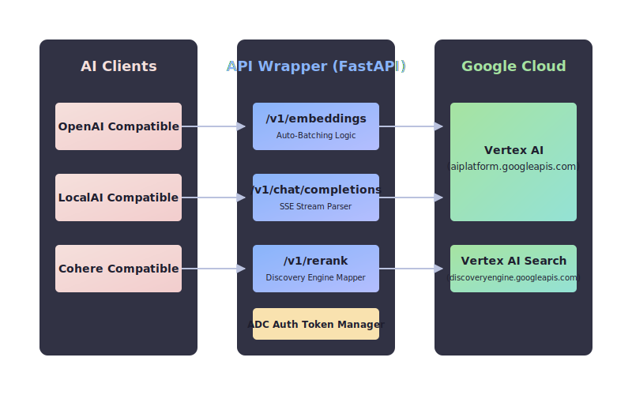

<div align="center">
  
</div>

<div align="center">
  
  
  
</div>

<br/>
<div align="center">
  <h3>Google Cloud Vertex AI (Google Agent Platform API) 임베딩 및 Rerank API를 OpenAI/LocalAI 규격 클라이언트에서 사용할 수 있게 해주는 프록시 서버입니다.</h3>
</div>
<br/>

<div align="center">
  <a href="#-시스템-아키텍처"></a> &nbsp;|&nbsp;
  <a href="#-빠른-시작"></a> &nbsp;|&nbsp;
  <a href="#-환경-변수-설정"></a> &nbsp;|&nbsp;
  <a href="#-api-참조"></a>
</div>

---

<br/>


## 💡 개발 배경 (Why?)

Google Agent Platform API(Vertex AI)의 우수한 모델들을 외부 오픈소스 생태계에 직접 연결하기에는 다음과 같은 까다로운 허들이 존재하여, 이를 중간에서 해결해주는 래퍼를 개발했습니다.

* **엔터프라이즈 보안 및 인증(Auth) 장벽**: 구글 AI Studio(개인/프로토타이핑용)는 연동이 쉬운 단순 API Key를 지원하지만 무료 티어 등에서 입력 데이터가 학습에 쓰일 위험이 있습니다. 반면, **데이터 프라이버시가 완벽히 보장되는 상용 엔터프라이즈용 Vertex AI**는 API Key 사용을 원천 차단하고 1시간마다 만료되는 임시 토큰(ADC/OAuth)을 강제합니다. 범용 오픈소스들은 고정 API Key만 지원하므로 백그라운드 갱신이 필요합니다.
* **배치 처리(Batching) 한계**: 외부 서비스는 한 번에 여러 데이터를 묶어 보내지만, 구글의 일부 모델(예: `gemini-embedding-001`)은 한 번에 1개씩의 입력만 허용하므로 중간에서 요청을 쪼개는 자동 분할(Auto-Batching)이 필수적입니다.
* **입출력 규격(Payload) 불일치**: 업계 표준인 OpenAI API 페이로드와 구글 Vertex 전용 페이로드 구조가 완전히 달라 실시간 통역기가 필요합니다.


## 🏛️ 시스템 아키텍처

<div align="center">
  
</div>


### 🎨 핵심 설계 포인트

<table width="100%">
  <tr>
    <td width="50%" valign="top">

#### 🟦 Drop-in Replacement
<p>기존 OpenAI/LocalAI 생태계 코드 변경 없이 Vertex AI를 그대로 사용 가능합니다.</p>
    </td>
    <td width="50%" valign="top">

#### 🟩 Native Reranking
<p><code>LocalAI</code> provider 규격을 통해 Vertex AI Search Ranking API를 완벽하게 연결합니다.</p>
    </td>
  </tr>
  <tr>
    <td width="50%" valign="top">

#### 🟪 Auto-Batching
<p>기존 클라이언트의 대용량 배치 요청을 Vertex AI의 모델별 한도(1~5개)에 맞춰 자동 분할 및 병렬 처리합니다.</p>
    </td>
    <td width="50%" valign="top">

#### 🟧 Auth Abstraction
<p>리프레시 토큰 관리 없이 ADC(Application Default Credentials) 서비스 계정을 통해 자동으로 OAuth2 토큰을 발급받습니다.</p>
    </td>
  </tr>
</table>

<br/>


## ⚙️ 환경 변수 설정 (Configuration)

`.env` 파일을 생성하거나 컨테이너 환경 변수로 다음 값을 주입합니다.

| Variable | Default | Description |
|---|---|---|
| `GOOGLE_APPLICATION_CREDENTIALS` | `""` | GCP 서비스 계정 JSON 키 경로 (필요 권한: `roles/aiplatform.user`). |
| `VERTEX_PROJECT` | *(Required)* | GCP 프로젝트 ID. |
| `VERTEX_LOCATION` | `us-central1` | Vertex API를 호출할 GCP 리전. |
| `WRAPPER_API_KEY` | `""` | 래퍼 서버를 보호하기 위한 선택적 API 키 (Bearer Token). |
| `VERTEX_TASK_TYPE_DEFAULT` | `RETRIEVAL_DOCUMENT` | 텍스트 임베딩을 위한 기본 Task Type. |
| `VERTEX_AUTO_TRUNCATE` | `true` | 토큰 제한 초과 시 400 에러 대신 자동으로 입력 텍스트를 자를지 여부. |
| `MAX_CONCURRENCY` | `8` | Vertex API에 대한 최대 동시 HTTP 요청 수. |
| `HTTP_TIMEOUT_SECONDS` | `60` | Vertex API HTTP 요청 타임아웃. |
| `TOKEN_REFRESH_SKEW_SECONDS` | `300` | Google OAuth 토큰 만료 전 사전 갱신 시간 (초). |
| `EXTRA_MODELS` | `""` | 콤마(,)로 구분된 추가 지원 모델 목록. |
| `MODEL_REGISTRY_JSON` | `""` | 복잡한 모델 라우팅을 위한 JSON 설정. |
| `DEFAULT_MAX_INSTANCES` | `1` | 알 수 없는 모델에 대한 병렬 호출 시 기본 청크 크기. |

<details>
<summary><b>💡 복잡한 모델 라우팅 추가 방법</b></summary>
<p>새로운 모델은 <code>EXTRA_MODELS</code> 환경 변수에 콤마로 구분하여 추가하거나, <code>MODEL_REGISTRY_JSON</code>을 통해 구체적인 API 타입, 리전, max_instances 등을 제어할 수 있습니다.</p>
</details>

<br/>


## 🚀 빠른 시작

### ⚡ 요구사항
- uv
- Docker 및 Docker Compose
- GCP 서비스 계정 JSON 키 파일 (`roles/aiplatform.user`)

### 🧪 로컬 환경 (uv 사용)

```bash
# 의존성 설치 및 백엔드 서버 실행
uv run uvicorn app:app --reload --port 8000
```

### 🐳 Docker Compose 환경

```bash
# 백그라운드 컨테이너 빌드 및 실행
docker compose up -d --build
```

<br/>


## 📡 API 참조

이 래퍼는 아래와 같은 호환 엔드포인트를 제공합니다.

| Method | Endpoint | 호환 규격 | 반환 형식 |
|---|---|---|---|
|  | `/v1/embeddings` | OpenAI 호환 | `encoding_format` 지원 |
|  | `/v1/chat/completions` | OpenAI 호환 | SSE Stream 지원 |
|  | `/v1/rerank` | Cohere / LocalAI 호환 | `results[{index, relevance_score}]` |

<br/>

<div align="center">
  
</div>

<div align="center">
  <a href="#-시스템-아키텍처"></a> &nbsp;|&nbsp;
  <a href="#-빠른-시작"></a> &nbsp;|&nbsp;
  <a href="#top"></a>
</div>
